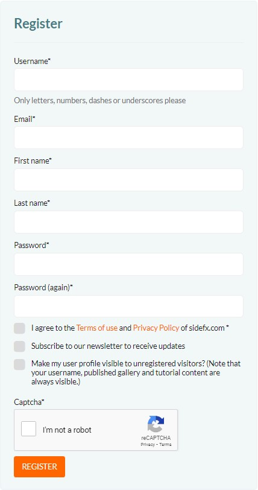
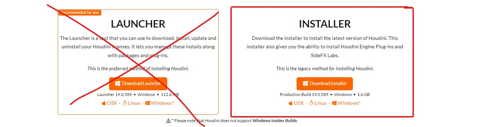
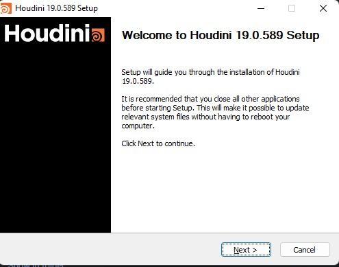
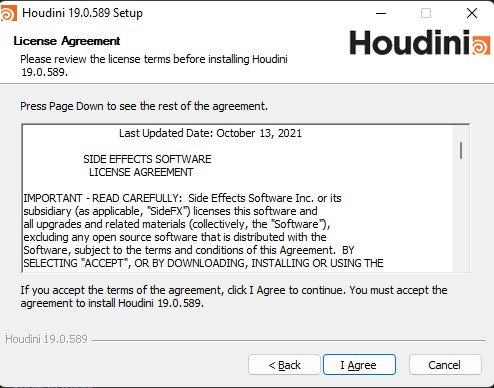
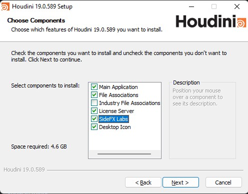
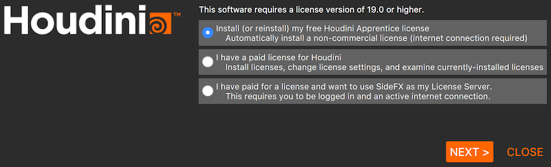

[TOC]


# Houdini ustanovka qilish

Houdinini ko'chirib olish uchun mana bu saytga o'ting: https://www.sidefx.com/download/. Agar sidefx.com saytida akkauntingiz bo'lmasa, oldin yangi akkaunt registratsiya qilish kerak. Agar siz tepadagi ssilkaga kirgan bo'lsangiz web sahifaning ong tarafida ushbu registratsiya formasini ko'rishingiz mumkin: 



Registratsiya formasini to'ldirganingizdan keyin, ko'rsatgan pochtaga sidefx.com dan email keladi. Emailda "activate account" degan knopka yoki ssilka ko'rishingiz kerak. Usha ssilkani ochsangiz siz yangi xosil qilgan akkaunt ochasiz. 

Akkauntga kirib tepada yozilgan ssilkaga qayta kirsangiz siz ushbu oynani ko'rasiz



Rasmda ko'rsatilgandek, Download Installerni bossangiz, houdini o'rnatish faylini ko'chirib olasiz. Ko'chirib olgan faylingizni ochsangiz houdini o'rnatish programmasi ochiladi. Programmani keyingi betiga o'tish uchun Next yoki Agree knopkalarini bosasiz. Programma oynalari quyidagi rasmlarda ko'rsatilgan.





Keyingi oynada SideFX Labs ni yoqishingiz kerak. Kurs davomida bizga kerak bo'ladi



Houdinini kompyuterga o'rnatish boshlanadigan oynagacha Next knopkalari bosib, Houdini o'rnatilishini kutamiz. Houdini o'rnatilib bo'lganida Finish knopkasi bilan chiqib ketasiz. Houdini o'rnatilgandan keyin, kompyuter o'chib-yonishi mumkin. 

Houdini ni birinchi marta ochganizda mana bunaqa oyna chiqishi kerak:



Install (or reinstall) my free Houdini licence, yani birinchi tanlangan xolda Next knopkasi bosilganda, houdini student litsenziyasini kompyuterga o'rnatadi.

Houdini ustanovka bo'lgandan keyin, agar sizda NVIDIA videokartasi bo'lsa, siz ushbu saytga kirib, videokarta modelini yozib, oxirgi driverni ko'chirib olishingiz kerak: https://www.nvidia.com/download/index.aspx Driverni ustanovka qilib bo'lgandan so'ng, kompyuterni o'chirib-yoqish kerak. 

# Konspektdagi slaydlar

Konspektdagi slaydlarda sichqoncha knopkalarini bosilganda sichqoncha belgisi va sichqonchaning bosilgan knopkasi qizil rangda aktivlashadi. Klaviaturada Ctrl, Shift, Alt knopkalar bosilganda xam kursor ustida sichqoncha belgisi yoki kursorni o'zi bilan bosilgan knopka yozuvini ko'rasiz. Shuningdek, klaviaturaning boshqa knopkalari bosilganda, bu knopkalar xam ekranni pasida oq yozuvda ko'rasiz. 

Slaydlarni ko'rganda, qaysi knopkalar bosilganini slayddagi podskazkalarda ko'rib oling

# Uyga vazifada berilgan ingliz tilidagi text ma'lumotlarni o'qish

Uyga vazifa sifatida, o'qib o'rganishga har hil websayt ssilkalari berilishi mumkin. Ular ko'pincha inglizcha yoki ruscha bo'ladi. Bunaqa tekst ma'lumotlarni google chrome brauseridan foydalanganda, mishkaning o'ng knopkasi bilan o'zbek tiliga o'girsa bo'ladi. Ushbu slayda bu jarayon ko'rsatilgan. 


Google chrome ning ushbu tarjimoni bizga ancha yordam beradi. 

```1Y4GuPjJCGe6nUvvtwah9JxVuxXmOh5yQ```

<a href="https://drive.google.com/uc?export=view&id=1Y4GuPjJCGe6nUvvtwah9JxVuxXmOh5yQ">
